```{r setup, include=FALSE}
knitr::opts_chunk$set(echo = F)
require(animation)
require(datasauRus)
require(dplyr)
require(ggplot2)
require(pander)
require(plotly)
require(lubridate)
```

# {data-background="img/What-Makes-a-Good-Infoviz.png"}

## Gestalt Principles


- Gestalt principles describe how the human eye perceives visual elements. 

## Cont.
<table>
  <tr>
  <td>
  <figure>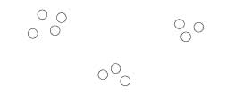<figcaption>Proximity</figcaption></figure>
  </td>
  <td>
  <figure>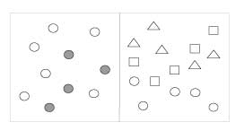<figcaption>Similarity</figcaption></figure>
  </td>
  <td>
  <figure>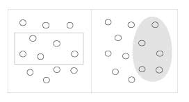<figcaption>Enclosure</figcaption></figure>
  </td>
  </tr>
  <tr>
  <td>
  <figure><figcaption>Closure</figcaption></figure>
  </td>
  <td>
  <figure>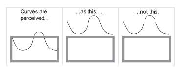<figcaption>Continuity</figcaption></figure>
  </td>
  <td>
  <figure><figcaption>Connection</figcaption></figure>
  </td>
  </tr>
</table>

- Complex scenes are reduced to simple shapes. 
- The eyes perceive shapes as a single, united form rather than the separate simpler elements involved.

## Tables vs. Pictures

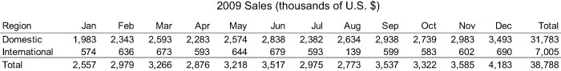


## Best of Both Worlds: The Web

```{r}

plot_data <- data.frame(
  month = seq(mdy("01-01-2009"), mdy("12-31-2009"), by = "month"),
  domestic = c(1983, 2343, 2593, 2283, 2574, 2838, 2382, 2634, 2938, 2739, 2983, 3493),
  international = c(574, 636, 673, 593, 644, 679, 593, 139, 599, 583, 602, 690)
)

plot_ly(plot_data, x = ~month, y = ~international, 
        type = "scatter", mode = "lines", name = "international") %>%
  add_trace(y = ~domestic, name = "domestic") %>%
  config(displayModeBar = F, showLink = F) %>%
  layout(title = "International and Domestic Sales",
         xaxis = list(title = "Month"), 
         yaxis = list(title = "Sales (thousands of $)"), 
         hovermode = "x",
         legend = list(orientation = 'h'))
```

## Friends don't let friends...


> * Clearly indicates the nature of the relationship? (Yes)
> * Represents the quantities accurately? (No)
> * Makes it easy to compare the quantities? (No)
> * Makes it easy to see the ranked order of values? (No)
> * Makes obvious how people should use the information? (Partially)

## 
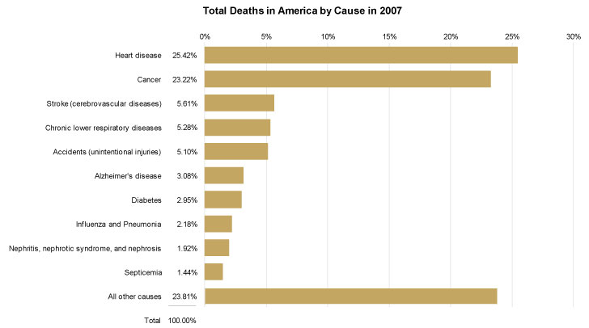

> * Clearly indicates the nature of the relationship? (Yes)
> * Represents the quantities accurately? (Yes)
> * Makes it easy to compare the quantities? (Yes)
> * Makes it easy to see the ranked order of values? (Yes)
> * Makes obvious how people should use the information? (Yes)


# The most misleading charts of 2015, Fixed 

## Skewing the y-axis
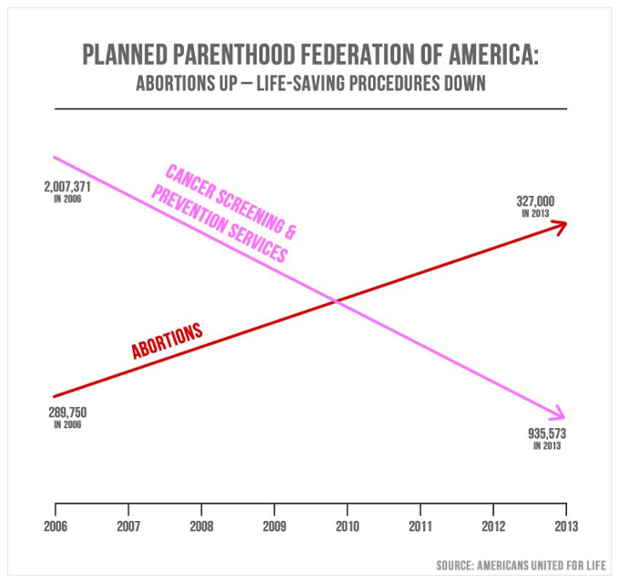

## Fixed
```{r}
pp <- read.csv("data/Planned Parenthood services.csv")

plot_ly(pp, x = ~year, y = ~Abortions, 
        type = "scatter", mode = "lines", name = "Abortion Procedures") %>%
  add_trace(y = ~Non.abortion.services, name = "Cancer Screening/Other Services") %>%
  config(displayModeBar = F, showLink = F) %>%
  layout(title = "Planned Parenthood Services",
         xaxis = list(title = "Year"), 
         yaxis = list(title = "Procedures (in millions)"), 
         hovermode = "x",
         legend = list(orientation = 'h'))
```

## No context


## Fixed

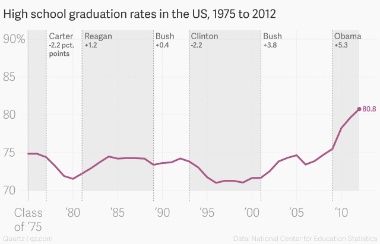

## No Perspective

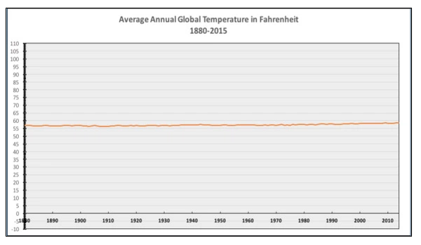

> The only #climatechange chart you need to see. http://natl.re/wPKpro - National
> Review

## Fixed

```{r}
temp <- read.csv("data/Average global temperature.csv")

plot_ly(temp, x = ~year, y = ~f, 
        type = "scatter", mode = "lines", name = "Average Global Temperature") %>%
  config(displayModeBar = F, showLink = F) %>%
  layout(title = "Average global temperature, 1880 to 2014",
         xaxis = list(title = "Year"), 
         yaxis = list(title = "Degrees (fahrenheit)"), 
         hovermode = "x",
         legend = list(orientation = 'h'))
```

## Misleading story

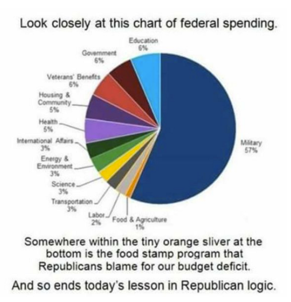

## Fixed

```{r}
gov_spend <- read.csv("data/US govt. discretionary and mandatory spending in 2015.csv")

plot_ly(gov_spend, x = ~X, y = ~Category.of.spending, type = "bar") %>%
  config(displayModeBar = F, showLink = F) %>%
  layout(title = "US govt. discretionary and mandatory spending in 2015",
         yaxis = list(title = "",
                      type = "category", 
                      categoryorder = "array", 
                      categoryarray = sort(gov_spend$X, decreasing = T)),
         xaxis = list(title = "% of total"),
         hovermode = "x",
         margin = list(l = 240, r = 50, b = 50, t = 50, pad = 4))
```

## Lies, plain and simple

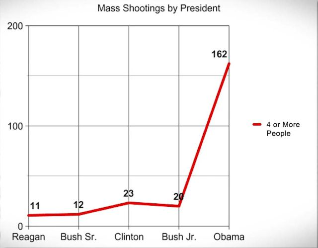

## Fixed

```{r}
shootings <- read.csv("data/Shootings resulting in four or more deaths.csv")

plot_ly(shootings, x = ~shootings, y = ~president, type = "bar") %>%
  config(displayModeBar = F, showLink = F) %>%
  layout(title = "Shootings resulting in four or more deaths",
         yaxis = list(title = "",
                      type = "category", 
                      categoryorder = "array", 
                      categoryarray = sort(shootings$shootings, decreasing = T)),
         xaxis = list(title = "* missing one year of data"),
         hovermode = "x",
         margin = list(l = 240, r = 50, b = 50, t = 50, pad = 4))
```

# DatasauRus {data-background="img/dino.png"}

## Getting Started

```{r, echo=TRUE, eval=FALSE}
# Install the software
install.packages("datasauRus")
require(datasauRus)
```

```{r, echo=TRUE}
head(
  datasauRus::datasaurus_dozen
)
```

## Data
```{r}
knitr::kable(datasaurus_dozen %>% 
    group_by(dataset) %>% 
    summarize(
      mean_x    = round(mean(x), 1),
      mean_y    = round(mean(y), 1),
      std_dev_x = round(sd(x), 1),
      std_dev_y = round(sd(y), 1),
      corr_x_y  = round(cor(x, y), 3))
)
```

## Graphs

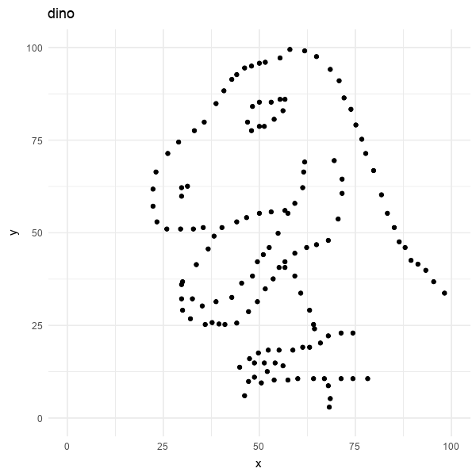

# Thank you!

##  {#contact-info .center}

Jonathan Hill, MPA

Senior Consultant, Data Science DevOps

hill@ficonsulting.com

585-967-5007
